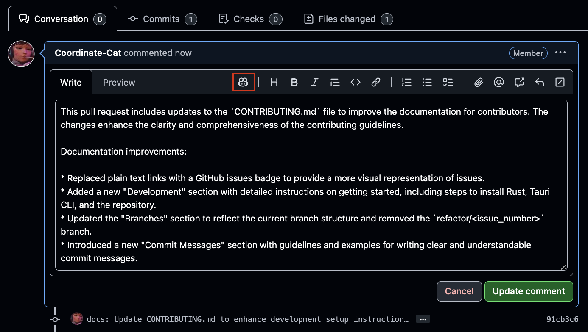
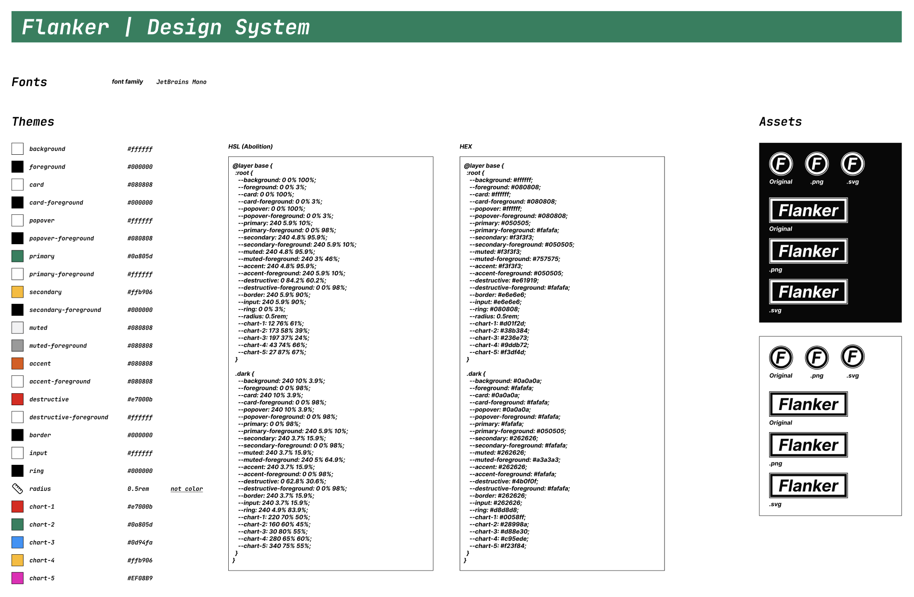

# Contributing to Flanker

## Issues


## ToC

- [Development](#development)
  - [Getting Started](#getting-started)
  - [Branches (WIP)](#branches-wip)
  - [Commit Messages](#commit-messages)
  - [Pull Requests](#pull-requests)
- [Directory Structure](#directory-structure)
  - [src/ (React: Colocation Patterns)](#src-react-colocation-patterns)
  - [src-tauri/ (Rust: Moduler Monolith)](#src-tauri-rust-moduler-monolith)
- [Types (WIP)](#types-wip)
- [Design System](#design-system)
  - [Figma](#figma)
- [Fonts](#fonts)
- [Contributions](#contributions)

## Development

### Getting Started

```sh
# Install Rust
curl --proto '=https' --tlsv1.2 https://sh.rustup.rs -sSf | sh

# Install Tauri CLI
cargo install tauri-cli

# Install Repo
git clone git@github.com:Flanker-Dev/Flanker.git
cd Flanker

# Install flk (Config and storage area for Flanker)
cd $HOME/.config
git clone git@github.com:Flanker-Dev/flk.git

# node version (2025-01-26)
cd Flanker
node -v
# v20.11.1

npm install
npm run tauri dev
npm run format
npm run lint
npm run tauri build

# Generate icon (Only when necessary)
npm run tauri icon src-tauri/icons/icon.png
```

### Branches (WIP)

```plaintext
main (production)
  ⎿ develop (current default branch)
    ⎿ feature/<issue_number> (feature branch)
    ⎿ document/<issue_number> (document branch)
    ⎿ ignore-issues (ignore issues)
```

### Commit Messages

```plaintext
There are no rules for now.
Please write a commit message that is easy to understand.

ex: feat: Add new feature
    fix: Fix bug
    docs: Update document
    style: Update style
    refactor: Refactor code
    test: Add test
    chore: Update chore
```

### Pull Requests

Please use the copilot feature to generate the First Convesation comment.


## Directory Structure

### src/ (React: Colocation Patterns)

We will adopt the philosophy of colocation patterns as much as possible to determine the directory structure of the tauri application.

```plaintext
src/
  ⎿ assets/ (Images, Docs Images, Logo, etc.)
  ⎿ components/
    ⎿ <component_name>/
      ⎿ <component_name>.tsx
      ⎿ <function_name>.ts (This file contains functions used only in components.)
    ⎿ ui/ (shadcn components)
  ⎿ constants/ (Constants.)
  ⎿ utils/ (Common or utility functions.)
  ⎿ hooks/ (Custom hooks.)
  ⎿ store/ (State management.)
  ⎿ types/ (Typescript types.)
```

### src-tauri/ (Rust: Moduler Monolith)

We will adopt the philosophy of moduler monolith as much as possible to determine the directory structure of the tauri application.

```plaintext
src-tauri/
  ⎿ icons/
  ⎿ src/
      ├── modules/
      │   ├── file_management/
      │   │   ├── mod.rs
      │   │   ├── file_handler.rs
      │   │   ├── image_handler.rs
      │   ├── media/
      │   │   ├── mod.rs
      │   │   ├── spotify_info.rs
      │   │   ├── github.rs
      │   ├── ui/
      │   │   ├── mod.rs
      │   │   ├── toggle_maximize.rs
      │   │   ├── toggle_tight.rs
      │   │   ├── resize/
      │   │       ├── increase_height.rs
      │   │       ├── decrease_height.rs
      │   │       ├── increase_width.rs
      │   │       ├── decrease_width.rs
      │   │   ├── window_position/
      │   │       ├── move_window_top_left.rs
      │   │       ├── move_window_top_right.rs
      │   │       ├── move_window_bottom_left.rs
      │   │       ├── move_window_bottom_right.rs
      │   ├── system/
      │       ├── mod.rs
      │       ├── system_info.rs
      │       ├── open_devtools.rs
      │       ├── window_events.rs
      ├── main.rs
```

## Types (WIP)

```typescript
export type Config = {
  sideMenuView: boolean;
  contentBodyView: boolean;
  titlebarView: boolean;
  alwaysOnTopView: boolean;
  isPrivacyMode: boolean;
  fullContentBodyView: boolean;
};

export type FileConfig = {
  bookmark: [
    {
      title: string;
      bookmarkInfo: [
        {
          title: string;
          url: string;
          description: string;
          tags: string[];
        },
      ];
    },
  ];
};
```

## Design System

### Figma

[Flanker | Design System](https://www.figma.com/design/BrFR62UWlk8nYXbvU9efGA/Flanker-dev?node-id=0-1&t=UlncTJYCQtidJaBH-1)



## Fonts

If you want to apply your own font, place the font in `$HOME/.config/flk/fonts`.
The recommended extension is `.woff` or `.woff2`.

- [Geist](https://vercel.com/font) (Default, Free)
- [JetBrains Mono](https://fonts.google.com/specimen/JetBrains+Mono) (Free)
- [Berkeley Mono](https://usgraphics.com/products/berkeley-mono) (Used in development environment, Paid: $75.00)

## Contributions

We are open to contributions. Please read the [Code of Conduct](CODE_OF_CONDUCT.md) before contributing.

<a href="https://github.com/Coordinate-Cat/Flanker/graphs/contributors">
  
</a>

Made with [contrib.rocks](https://contrib.rocks).
